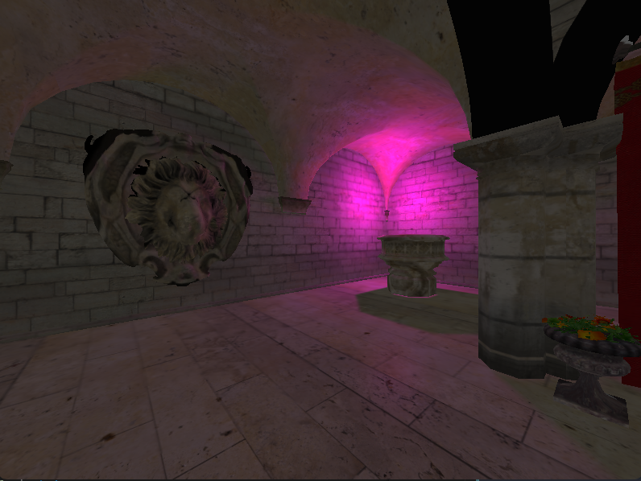

# README

## Описание

Приложение представляет собой визуализатор 3D-сцен в формате OBJ с поддержкой:

- загрузки сцен формата OBJ и текстур;
- освещения по модели Фонга (Phong Lighting);
- двух динамических источников света:
  - направленный источник света («солнце»);
  - точечный источник света;
- теней от обоих источников света с использованием Shadow Mapping;
- сглаживания теней (PCF/VSM);
- свободно управляемой камеры.

---

## Сборка и запуск

```bash
mkdir build
cd build/
cmake -DCMAKE_POLICY_VERSION_MINIMUM=3.5 ..
make -j4
./homework2
```

---

## Управление

- `SDLK_w` — лететь вперёд
- `SDLK_s` — лететь назад
- `SDLK_LEFT` — поворот налево
- `SDLK_RIGHT` — поворот направо
- `SDLK_SPACE` — пауза

---

## Необходимые данные

Сцена должна находиться по пути:

```text
homework2/data/sponza/sponza.obj
```

Сцену можно скачать по ссылке:

https://casual-effects.com/data/index.html

Название сцены: **Crytek Sponza**.

---

## Скриншоты

### Общий вид сцены


