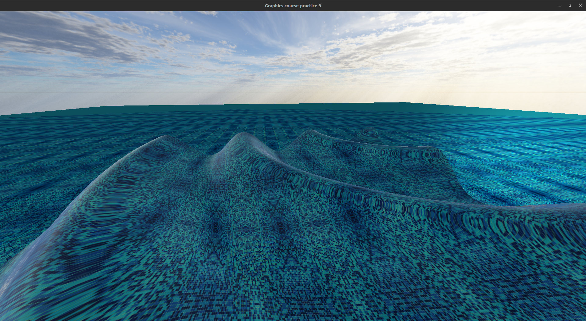

# Water simulation

Just a small project to show beatuful water render via OpenGL

## Build and Run

```bash
mkdir build
cd build/
cmake ..
make -j4
./project_water
```

## Keys bindings

| Key           |  Function                 |
|---------------|---------------------------|
| W             | Move forward              |
| S             | Move backward             |
| A             | Move left                 |
| D             | Move right                |
| Up            | Rotate camera upside      |
| Down          | Rotate camera downside    |
| Left          | Rotate camera leftside    |
| Right         | Rotate camera rightside   |
| Left Shift    | Move upside               |
| Left Ctrl     | Move downsize             |

## Screenshots


